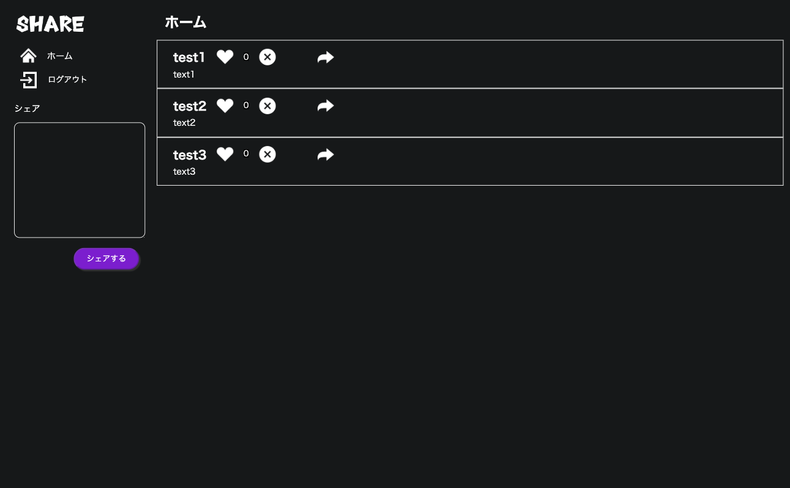
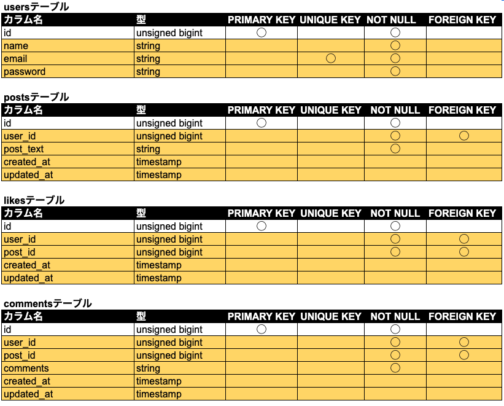
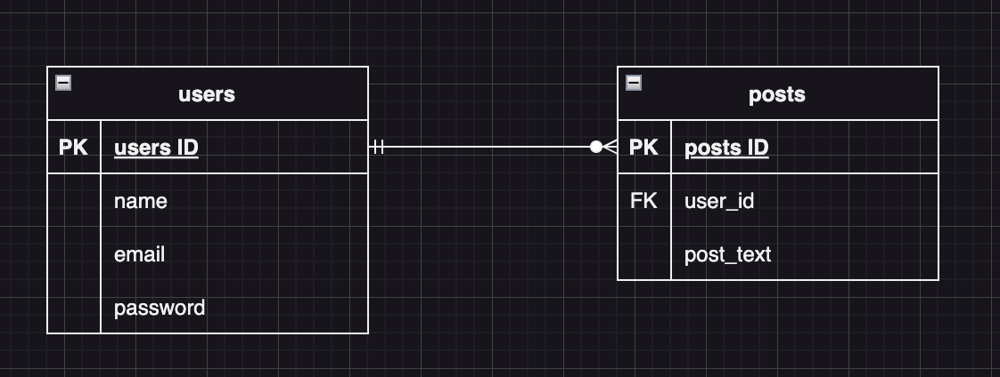
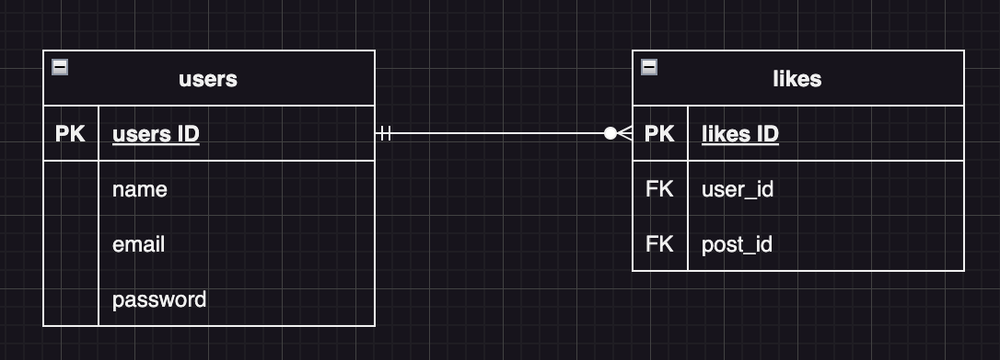
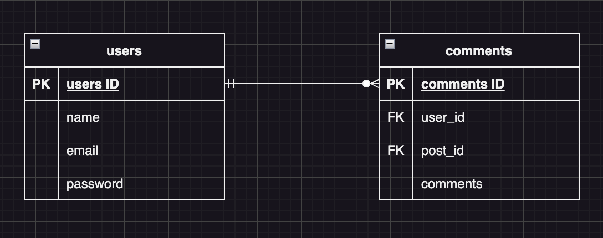
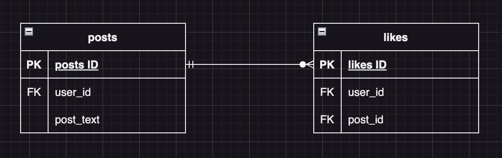
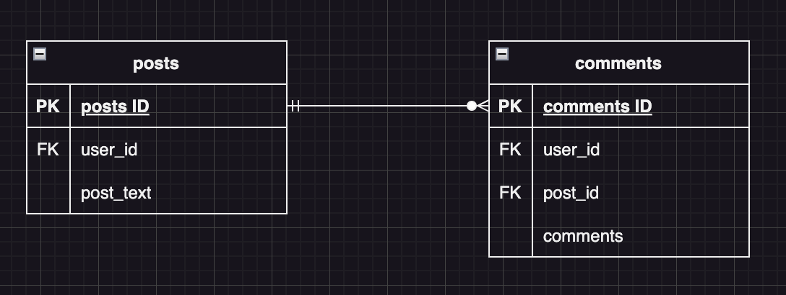

# Twitter風SNSアプリ

【概要】Twitter風SNSアプリ

【イメージ】

## 作成した目的

【背景と目的】 何気ないことをつぶやくことができるTwitter風SNSアプリを作成する。

## 機能一覧

| 項目 |
| ---- |
| ユーザー認証（Firebase Authentication） |
| 投稿の一覧表示　追加処理　削除処理 |
| 投稿した名前と投稿内容が表示される |
| 投稿の追加 |
| バツマークを押すと投稿が削除される |
| いいね機能 |
| ハートマークを押すと良いね数が増えたり減ったりする |
| コメント機能 |
| 矢印マークを押すとコメント画面に遷移する |
| コメントした名前と投稿内容が表示される |
| コメントの追加 |

## 使用技術

* Nuxt v2.15.8
* vee-validate v3
* vue v2.7.10
* @nuxtjs/axios v5.13.6

## テーブル設計

## ER図

# 環境構築

## git clone

先にコピーを保存したいディレクトリに移動してから以下のコマンドを実行します。

`$ git clone git@github.com:magmag6240/snspj.git`

これでNuxtプロジェクトがローカル環境にクローンされます。

## yarnのインストールする
以下のコマンドでインストールを行います。

`$ node -v # Node.jsのバージョン確認`  
`$ npm -v # npmのバージョン確認`  
`$ sudo npm install -g yarn # yarnインストール`  

## Firebaseの設定

https://firebase.google.com/ にてプロジェクトを作りましょう。そして、Firebaseを読み込みましょう。Nuxt.jsのプラグインを使います。

plugins/firebase.jsを作成したプロジェクトに対応するよう、書き換えてください。

## ライブラリの追加

以下のコマンドでライブラリを入れます。

`$ yarn add firebase`  
`$ yarn add vee-validate@3`  

## 動作確認
ブラウザに表示する準備は整いました。
以下のコマンド実行で、動作確認を行ってください。

`$ yarn dev`

## ユーザー

* 一般会員（使用可能）：3人

### 一般会員

| id | name | email | password |
| ---- | ---- | ---- | ---- |
| 1 | test1 | test1@example.com | password |
| 2 | test2 | test2@example.com | password |
| 3 | test3 | test3@example.com | password |
